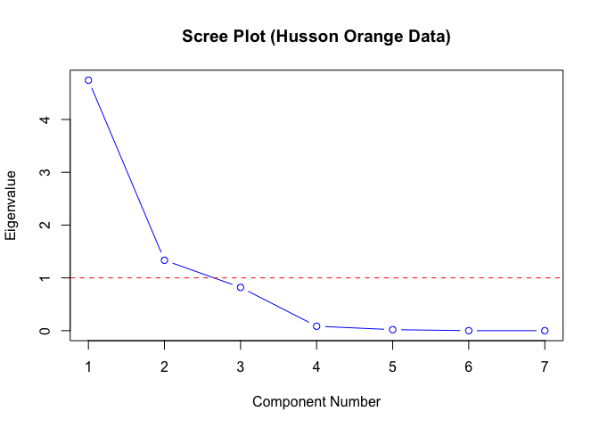
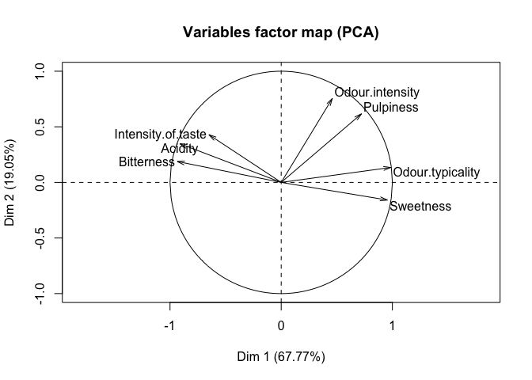
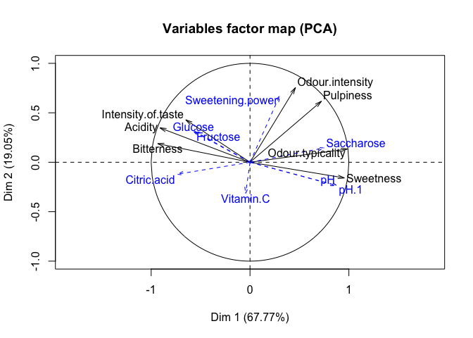
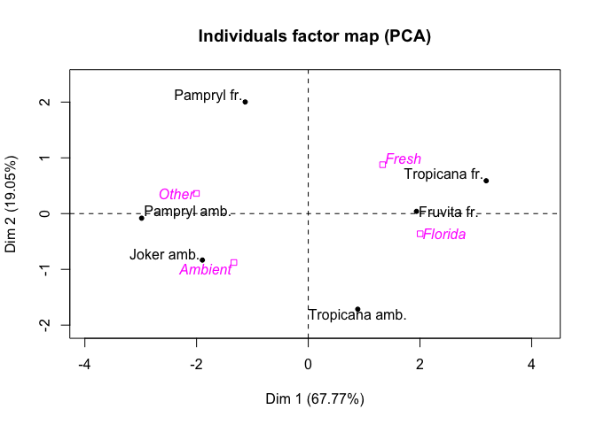
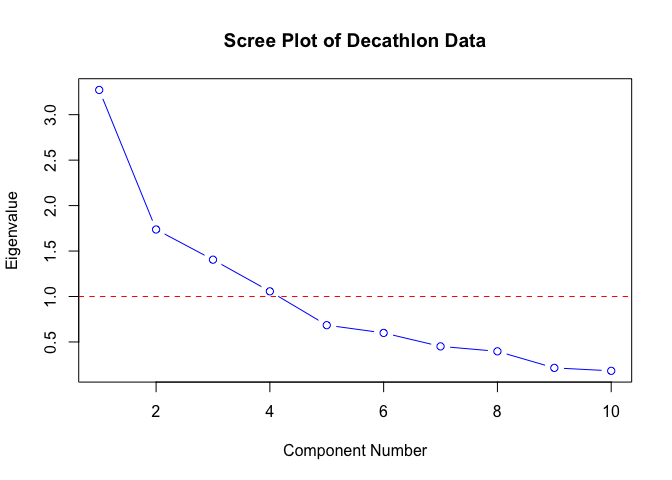
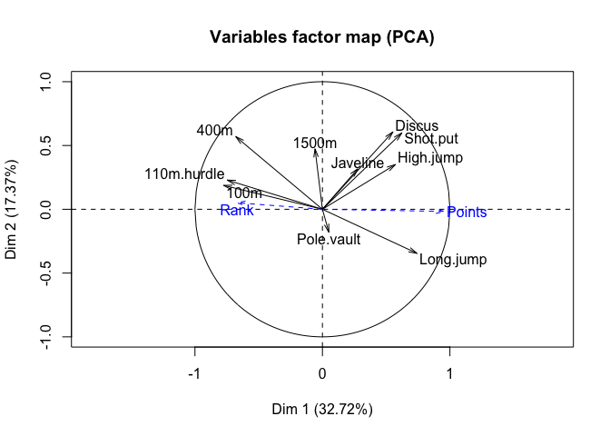

reorganizing---
layout: posts
title: "Principal Components Analysis using Linear Algebra"
date: 2017-03-30
---

Now that we've learned about linear algebra, let's apply our newfound
knowledge to an example Frankensteined from [James
Steiger](http://www.statpower.net/P312.html), who in turn borrowed from
[Exploratory Multivariate Analysis by Example Using R by Husson, Le and
Pages](https://www.crcpress.com/Exploratory-Multivariate-Analysis-by-Example-Using-R/Husson-Le-Pages/p/book/9781439835807).

We can use matrix decomposition for dimensionality reduction. As an
enormous oversimplification: many things relate to many other things.
principal components analysis (PCA) is a method by which we can select
those factors that share similar properties along a dimension. This is
useful for selecting combinations of factors for a metric, or finding
factors that explain the variance of other factors, or potentially
finding the underlying communal properties of several factors that
explain data in a broader, more abstract way.

The Orange Dataset
------------------

Let's start with some sample data.

    library("FactoMineR")
    options(width=70)
    orange <- read.csv("orange.csv",row.names=1)
    head(orange)

    ##                Odour.intensity Odour.typicality Pulpiness
    ## Pampryl amb.              2.82             2.53      1.66
    ## Tropicana amb.            2.76             2.82      1.91
    ## Fruvita fr.               2.83             2.88      4.00
    ## Joker amb.                2.76             2.59      1.66
    ## Tropicana fr.             3.20             3.02      3.69
    ## Pampryl fr.               3.07             2.73      3.34
    ##                Intensity.of.taste Acidity Bitterness Sweetness
    ## Pampryl amb.                 3.46    3.15       2.97      2.60
    ## Tropicana amb.               3.23    2.55       2.08      3.32
    ## Fruvita fr.                  3.45    2.42       1.76      3.38
    ## Joker amb.                   3.37    3.05       2.56      2.80
    ## Tropicana fr.                3.12    2.33       1.97      3.34
    ## Pampryl fr.                  3.54    3.31       2.63      2.90
    ##                Glucose Fructose Saccharose Sweetening.power   pH pH.1
    ## Pampryl amb.     25.32    27.36      36.45            89.95 3.59 3.59
    ## Tropicana amb.   17.33    20.00      44.15            82.55 3.89 3.89
    ## Fruvita fr.      23.65    25.65      52.12           102.22 3.85 3.85
    ## Joker amb.       32.42    34.54      22.92            90.71 3.60 3.60
    ## Tropicana fr.    22.70    25.32      45.80            94.87 3.82 3.82
    ## Pampryl fr.      27.16    29.48      38.94            96.51 3.68 3.68
    ##                Citric.acid Vitamin.C Way.of.preserving  Origin
    ## Pampryl amb.          0.84     43.44           Ambient   Other
    ## Tropicana amb.        0.67     32.70           Ambient Florida
    ## Fruvita fr.           0.69     37.00             Fresh Florida
    ## Joker amb.            0.95     36.60           Ambient   Other
    ## Tropicana fr.         0.71     39.50             Fresh Florida
    ## Pampryl fr.           0.74     27.00             Fresh   Other

We have a matrix of values for six kinds of oranges, rated by their
attributes on 16 scales (e.g., Odor Intensity and Pulpiness). Using PCA,
we can find the attributes that co-occur to identify the underlying
explanatory features (the "principal components") that can describe the
oranges in fewer dimensions.

Principal components are defined to be those linear components that are
of maximum variance, with the restriction that components be orthogonal
to one another (projecting into different, perpendicular parts of
n-dimensional space). Essentially, a principal component is a group of
factors which high correlation that are uncorrelated with other
principal components.

It is worth noting that variables should be standardized prior to
analysis; otherwise, high variance factors will overwhelm low variance
factors. These values are already normed, but most users are advised to
log transform the z-scores of their data before beginning.

In this example, we break the dataset into three parts: the first seven
variables (which Steiger calls the "sensory variables") will go into our
initial factor analysis. The next eight variables (the quantitative
supplement) are supplementary variables that we will plot onto the
sensory variables. The last two variables are qualitative supplements,
pre-existing labels for the data (based on method of preservation and
origin of the juices). The idea is to see how new data fits with an
initial understanding of principal components.

    # conducting the principal components analysis
    # witholding visualization for now
    res.pca <- PCA(orange,quanti.sup=8:15,quali.sup=16:17,graph=FALSE)

Now we must decide how many principal components to keep. There will
always be at least one principal component, suggesting that every factor
contributes to the variance in a correlated way.

To find the principal components, we first generate the correlation
matrix, R, of all factors with themselves.

    R <- cor(orange[,1:7])
    R

    ##                    Odour.intensity Odour.typicality   Pulpiness
    ## Odour.intensity          1.0000000        0.5822691  0.65636358
    ## Odour.typicality         0.5822691        1.0000000  0.76762190
    ## Pulpiness                0.6563636        0.7676219  1.00000000
    ## Intensity.of.taste      -0.2679038       -0.6169978 -0.02007904
    ## Acidity                 -0.1451383       -0.8378460 -0.46820605
    ## Bitterness              -0.1538500       -0.8775382 -0.64380421
    ## Sweetness                0.2332185        0.9230997  0.62974607
    ##                    Intensity.of.taste    Acidity Bitterness
    ## Odour.intensity           -0.26790383 -0.1451383 -0.1538500
    ## Odour.typicality          -0.61699781 -0.8378460 -0.8775382
    ## Pulpiness                 -0.02007904 -0.4682061 -0.6438042
    ## Intensity.of.taste         1.00000000  0.7274892  0.5137816
    ## Acidity                    0.72748916  1.0000000  0.9137038
    ## Bitterness                 0.51378162  0.9137038  1.0000000
    ## Sweetness                 -0.56861744 -0.9005740 -0.9756863
    ##                     Sweetness
    ## Odour.intensity     0.2332185
    ## Odour.typicality    0.9230997
    ## Pulpiness           0.6297461
    ## Intensity.of.taste -0.5686174
    ## Acidity            -0.9005740
    ## Bitterness         -0.9756863
    ## Sweetness           1.0000000

We then find the eigenvalues of *R*. The variance of a principal
component is directly related to it's eigenvalue (the number required to
stretch the eigenvectors to match the original matrix; bigger eigenvalues
== more influence, assuming standardized scores). The proportion of
variance of the entire correlation matrix explained by a single
principal component eigenvalue, *λ**j*, is equal to its
proportion to the total number of factors in the correlation matrix,
*p*, or simply *λ**j*/*p*. A commonly used computational
trick for finding *p* is to simply take the trace of *R*, which is
necessarily the number of factors in the matrix.

There are several loose rules for determining number of principal
components, although it should be said that these criteria are a bit
fuzzy and should be carefully tailored to theory. These rules are: 1.
The number of components necessary to explain 80% of the variance 2. Any
components with an eigenvalue greater than 1 3. All components up to a
"clear breaking point in the scree"

    round(res.pca$eig, 2)

    ##        eigenvalue percentage of variance
    ## comp 1       4.74                  67.77
    ## comp 2       1.33                  19.05
    ## comp 3       0.82                  11.71
    ## comp 4       0.08                   1.20
    ## comp 5       0.02                   0.27
    ##        cumulative percentage of variance
    ## comp 1                             67.77
    ## comp 2                             86.81
    ## comp 3                             98.53
    ## comp 4                             99.73
    ## comp 5                            100.00

By the first rule of thumb, we would take two components (67.77% and
19.05% of the variance explained), and by the second we would take the
same two components (both eigenvalues above 1).

A scree plot refers to a geological phenomenon, where rocks rolling down
a mountain settle at the base of a peak. In this case, we can look for
eigenvalues that settle at a clear break in the descent when visualizing
our data.

    Scree.Plot <- function(R,main="Scree Plot",sub=NULL){
      roots <- eigen(R)$values
      x <- 1:dim(R)[1]
      plot(x,roots,type="b",col='blue',ylab="Eigenvalue",
           xlab="Component Number",main=main,sub=sub)
      abline(h=1,lty=2,col="red")
    }
    Scree.Plot(R,main ="Scree Plot (Husson Orange Data)")

Component 2 is the clear "breaking point" of our Scree plot, although
researchers with a firm theoretical reason could possibly include a
third component by this rule.

We can plot the variables according to the dimensions of these two
components

    plot(res.pca,choix="var",invisible="quanti.sup")

From this we see two components that predict 86.82% of our variance. We
can label Dim 1 as a "Sweetness dimension", ranging from bitter/acidic
to sweet tasting and smelling. We can label Dim 2 as an "Intensity
dimension" of pulpiness and flavor. Note the "art" of interpreting
components.

We can also generate this map with our supplimental quantitative
variables overlaid.

    plot(res.pca,choix="var")

Here we can see some relationships. The Sweetness dimension appears to
be most influenced by measurable acidic and presence of sugars, while
the Intensity dimension appears to be related to "Sweetening power",
whatever that means. We also see Vitamin C hanging out , relatively
unrelated to anything but mildly negatively correlated with the
Intensity dimension.

Next we can plot the results of individual juices on our map of
principal components.

    # results of individual juices on our map of principal components
    plot(res.pca,choix="ind")

    # we see that "Pampryl fr" is high in

We see that fruit origin maps on interestingly to the Sweetness
dimension, while preservation method maps on slightly to the Intensity
dimension.

### Orange Juice from Scratch

We can derive the principal components of the orange data from
eigenvectors and eigenvalues.

    V <- eigen(R)$vectors[,1:2]
    D <- eigen(R)$values[1:2]
    D <- diag(D)
    D.half <- sqrt(D)
    F <- V%*%D.half
    rownames(F)<-colnames(R)
    F

    ##                          [,1]       [,2]
    ## Odour.intensity    -0.4595600 -0.7544770
    ## Odour.typicality   -0.9853589 -0.1341544
    ## Pulpiness          -0.7216192 -0.6166377
    ## Intensity.of.taste  0.6498301 -0.4289005
    ## Acidity             0.9127077 -0.3483266
    ## Bitterness          0.9347538 -0.1880066
    ## Sweetness          -0.9548570  0.1586863

    D

    ##          [,1]    [,2]
    ## [1,] 4.743693 0.00000
    ## [2,] 0.000000 1.33329

    D/sum(eigen(R)$values) #variance explained

    ##           [,1]    [,2]
    ## [1,] 0.6776704 0.00000
    ## [2,] 0.0000000 0.19047

Where F is the range of scores on each dimension, D are the eigenvalues
and *D*/*t**r*(*D*) is the variance explained.

The Decathlon Dataset
---------------------

Let's practice on a new dataset. The Decathlon data was collected from
the Olympic and Decastar decathlon events held a month apart in 2004.
Scores represent individual performance on 10 events by each athlete who
performed in both events.

We begin by reoganizing the data to standard scores, which accounts for
better track scores being lower while better field scores being higher.

    data(decathlon)
    decathlon2 <- decathlon
    decathlon2$`100m` <- -decathlon2$`100m`
    decathlon2$`400m` <- -(decathlon2$`400m`)
    decathlon2$`1500m` <- -(decathlon2$`1500m`)
    decathlon2$`110m.hurdle` <- -(decathlon2$`110m.hurdle`)

We then calculating the correlation matrix and the scree plot.

    R <- cor(decathlon[,1:10])
    Scree.Plot(R, main = "Scree Plot of Decathlon Data")

We can see that there are about 4 principal components from this scree
plot. Let's enter the variables into a PCA, again in three parts: the
factors, the quantitative supplements of overall rank and score of each
athlete, and the qualitative supplements of the competition performed in
(Olympics or Decastar). If we look at variance explained...

    res2.pca <- PCA(decathlon, quanti.sup = 11:12, quali.sup = 13, graph = FALSE)
    round(res2.pca$eig,2)

    ##         eigenvalue percentage of variance
    ## comp 1        3.27                  32.72
    ## comp 2        1.74                  17.37
    ## comp 3        1.40                  14.05
    ## comp 4        1.06                  10.57
    ## comp 5        0.68                   6.85
    ## comp 6        0.60                   5.99
    ## comp 7        0.45                   4.51
    ## comp 8        0.40                   3.97
    ## comp 9        0.21                   2.15
    ## comp 10       0.18                   1.82
    ##         cumulative percentage of variance
    ## comp 1                              32.72
    ## comp 2                              50.09
    ## comp 3                              64.14
    ## comp 4                              74.71
    ## comp 5                              81.56
    ## comp 6                              87.55
    ## comp 7                              92.06
    ## comp 8                              96.03
    ## comp 9                              98.18
    ## comp 10                            100.00

    sum(res2.pca$eig[1:4,2]) #sum of first four components

    ## [1] 74.70804

...we see that four components get us close to the 80% variance
explained threshold. Between the three guidelines of eigenvalues &gt; 1
(four components), scree (four components) and 80% variance (five
components), we can reasonably settle on including four principal
components in the analysis.

    plot(res2.pca,choix="var")

    plot(res2.pca,choix="ind")

    V <- eigen(cor(decathlon2[,1:10]))$vectors[,1:2]
    D <- eigen(cor(decathlon2[,1:10]))$values[1:2]
    D <- diag(D)
    D.half <- sqrt(D)
    F <- V%*%D.half
    rownames(F)<-colnames(decathlon2)[1:10]
    F

    ##                    [,1]       [,2]
    ## 100m        -0.77471983 -0.1871420
    ## Long.jump   -0.74189974 -0.3454213
    ## Shot.put    -0.62250255  0.5983033
    ## High.jump   -0.57194530  0.3502936
    ## 400m        -0.67960994 -0.5694378
    ## 110m.hurdle -0.74624532 -0.2287933
    ## Discus      -0.55246652  0.6063134
    ## Pole.vault  -0.05034151 -0.1803569
    ## Javeline    -0.27711085  0.3169891
    ## 1500m       -0.05807706 -0.4742238

    D

    ##          [,1]     [,2]
    ## [1,] 3.271906 0.000000
    ## [2,] 0.000000 1.737131
